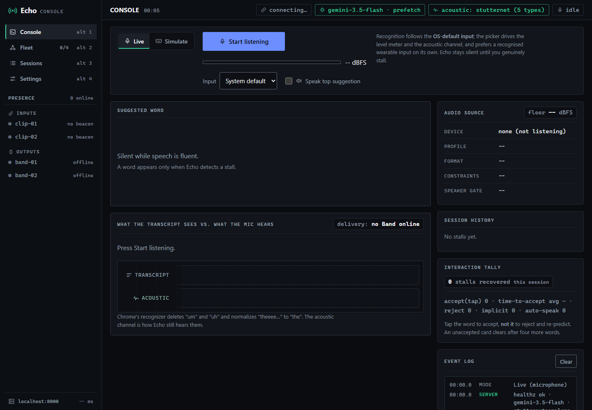

# Echo — real-time aphasia word-finding co-pilot

Echo listens to a person with **aphasia/anomia**, detects the moment they get
stuck searching for a word, and offers the **intended word** in ~1–2 s — or
instantly via prefetch — so they finish *their own* sentence. HackMIT — Health &
Accessibility.



**Status: v6.** Dual-channel sensing (transcript + raw acoustic), speculative
prefetch, a recognised wireless-lav input (DJI Mic 2S on the speaker). **515
tests** **+ 5/5 live e2e**, passing.

**The v2 thesis:** consumer ASR erases exactly the stall signals that matter for
aphasia — Chrome deletes "um/uh" (no off switch) and every pipeline normalizes
"theeee…" → "the". So Echo listens to the raw audio in parallel. System-level
proof: in a full synthetic conversation stream the fused detector catches
**36/39 (92.3%)** of embedded filler stalls a median **540 ms before** the
transcript-only fallback fires (`docs/EVAL.md` §6). Full design:
[`docs/ARCHITECTURE.md`](docs/ARCHITECTURE.md).

## Evidence

Every number regenerates from `eval/` into `docs/EVAL.md`, the source of truth.

- **Detection.** Fused detector catches **36/39 (92.3%)** of embedded stalls, a
  median **540 ms before** a transcript-only system. Acoustic filler detection
  lands at **755 ms median, ~1.7× earlier** than the 1300 ms pause baseline.
- **Prediction.** On the frozen 60-item circumlocution set the top candidate is
  the intended word **58/60 (96.7%)**, top-3 **59/60**; removing conversation
  context collapses proper-noun recovery **19/20 → 2/20**, proving the context
  pipe carries real weight.
- **Restraint.** The prolongation detector fires **0 false positives per 120 s**
  of running speech. Echo stays silent while you are fluent, by design.

**Next milestone:** validation on recorded aphasic speech with an SLP in the
loop. The frozen evals and the recording protocol (`eval/record_protocol.md`) are
in place for it.

## Architecture

```
 mic (laptop, or DJI Mic 2S lav on the speaker) ─► PCM16 ─► /ws/audio
                                                                │
 transcript channel:  CrisperWhisper verbatim (server, same PCM) ┤
                       keeps "[UM]", "f- Facebook", "you you"     ├─► fused StallDetector ─► prefetch cache (~0 ms hit ⚡)
 acoustic channel:    the SAME PCM ─────────────────────────────┘        │              └─► predictor (~1.5s)
                       └► Silero VAD + StutterNet (5 types) + prolongation ▼
                                                              word cards + TTS (browser)
```

- **`backend/stall_detector.py`** — deterministic per-word state machine;
  triggers (pause 1.3 s / filler / hedge / block / sound_rep / word_rep /
  prolongation), one shared debounce, per-episode re-arm, cross-trigger
  refractory. Silent on fluent speech.
- **`backend/stt/verbatim.py`** — server-side CrisperWhisper on the same PCM.
  LocalAgreement-2 streaming with a force-commit on VAD silence (a stall *is* a
  silence, and the predictor can't run on a sentence missing its last word).
- **`backend/acoustic/`** — Silero VAD gating + StutterNet (~583k-param CNN, five
  dysfluency types incl. **Block**, SEP-28k) + rule-based prolongation. FillerNet
  remains for the published v2 benches. Voiced-time, confidence, refractory gates.
- **`backend/pipeline.py`** — orchestration + speculative prefetch (shadow while
  fluent; `⚡ prefetch` at ~0 ms (bench, n=20) / <300 ms (live e2e) on a stall).
- **`backend/predictor/`** — `WordPredictor` interface; DeepSeek (default),
  `gemini.py`, `claude.py`, `local`, `mock.py`. One-env-var swap.
- **`backend/app.py` / `session.py`** — FastAPI, two WebSockets (`/ws` for
  transcript JSON, `/ws/audio` for binary PCM16), the audio-source registry
  (`/api/audio/sources`).

## Quick start

```bash
python -m venv .venv && .venv\Scripts\activate     # (or source .venv/bin/activate)
pip install -r requirements-dev.txt
cp .env.example .env                               # put your predictor key in .env

python -m pytest                                   # 515 tests, offline, no key needed
uvicorn backend.app:app --port 8000                # open http://localhost:8000 in Chrome
```

Open **🎤 Live**, press *Start listening*, speak, and stall mid-sentence — the
dual-channel panel shows what the transcript missed. **⌨ Simulate** drives the
identical pipeline from typed text (venue-proof fallback).

### Acoustic model (FillerNet)

Without `models/fillernet.pt` Echo runs **prolongation-only** (still demos). To train:

```bash
python scripts/fetch_pfsd.py        # cut the 85,803 PodcastFillers clips (long; background it)
python scripts/train_filler.py      # train + eval -> models/fillernet.pt (gate: filler F1 >= 0.75)
python scripts/train_filler.py --eval-only
```

Metrics land in `models/fillernet_metrics.json`; headline numbers belong in
`docs/EVAL.md` — quote that, not memory.

### Verify end-to-end & reproduce evals

```bash
python -m scripts.e2e_live          # live e2e vs real API: 5 cases, all pass
python -m scripts.replay            # offline detector replay harness
```

Every number in [`docs/EVAL.md`](docs/EVAL.md) is generated from
`eval/results/*.json`, never hand-typed — regenerate after any change to the
detector, model, or prompts. Most scripts need the local PFSD dataset
(`scripts/fetch_pfsd.py`) and/or `models/fillernet.pt`, and degrade to a
`SKIPPED` status rather than failing when inputs are absent:

```bash
python eval/run_stall_eval.py             # acoustic filler classification (PFSD test split)
python eval/run_latency_bench.py          # detection + serving latency benches
python eval/run_prolongation_eval.py      # prolongation-rule validation on real audio
python eval/run_dual_channel_ablation.py  # system-level acoustic-vs-transcript-only ablation
python eval/run_noise_stress.py           # FillerNet noise-robustness stress test
python eval/run_prediction_eval.py --provider gemini                  # frozen 60-item set
python eval/run_prediction_eval.py --provider gemini --ablate-context # context-ablation companion
python eval/make_report.py                # regenerate docs/EVAL.md from eval/results/*.json
```

**Freeze protocol:** `eval/data/prediction_eval_set.jsonl` is frozen at its first
commit — after the first live run, items may never be edited, added, or removed
in response to results; any change requires a new versioned filename with both
result sets kept. `docs/EVAL.md` is generated output: to change it, edit
`eval/make_report.py` and re-run — never hand-edit the generated file.

## Configuration (.env)

| Want | Set |
|------|-----|
| DeepSeek (default) | `PREDICTOR_PROVIDER=deepseek`, `DEEPSEEK_API_KEY=…`, `DEEPSEEK_MODEL=deepseek-flash` |
| Gemini | `PREDICTOR_PROVIDER=gemini`, `GEMINI_API_KEY=…`, `GEMINI_MODEL=gemini-3.5-flash` |
| Claude | `PREDICTOR_PROVIDER=claude`, `ANTHROPIC_API_KEY=…` (`pip install anthropic`) |
| Fully offline (local LLM) | `PREDICTOR_PROVIDER=local` (see [`docs/DEPLOYMENT.md`](docs/DEPLOYMENT.md)) |
| No key / quick look | `PREDICTOR_PROVIDER=mock` |

Higher-recall detector on a GPU machine: `STUTTER_BACKEND=ssl ACOUSTIC_DEVICE=cuda`
(see [`docs/DETECTION_TUNING.md`](docs/DETECTION_TUNING.md)).

Tuning: `STALL_PAUSE_MS` (1300) · `MAX_CANDIDATES` (3) · `CONTEXT_TURNS` (6,
verbatim-layer cap) · `CONTEXT_BUDGET_TOKENS` (2048, approximate) ·
`ACOUSTIC_MODEL` (`models/fillernet.pt`) · `ACOUSTIC_CONF` (0.75) · `PREFETCH`
(on) · `PREFETCH_EVERY` (3).

> `gemini-3.5-flash` is a *thinking* model — the provider sets `thinking_budget=0`,
> otherwise it spends the whole output budget on thoughts and returns nothing
> (and it's faster without thinking, which this loop needs).

## Microphone

The speaker wears a **DJI Mic 2S** wireless lavalier; its USB receiver is an
ordinary audio input that the console recognises and auto-prefers over the
laptop array. Same bytes on `/ws/audio` either way — the capsule is just 5 cm
from the mouth instead of on the table. Measured compatibility, the browser
constraints the console applies, and what may and may not be claimed:
[`docs/MICROPHONE.md`](docs/MICROPHONE.md).

## Docs

**Full, role-routed index: [`docs/README.md`](docs/README.md).** The most-used
entry points:

| File | What |
|---|---|
| [`docs/PITCH.md`](docs/PITCH.md) | Echo in one page: problem, claim, what is and isn't proven |
| [`docs/DEMO_SCRIPT.md`](docs/DEMO_SCRIPT.md) | The 4-beat live demo + fallback drill + video script + prep |
| [`docs/MICROPHONE.md`](docs/MICROPHONE.md) | The DJI Mic 2S as input: measured compatibility, console profile, audio tiers |
| [`docs/ARCHITECTURE.md`](docs/ARCHITECTURE.md) | Dual-channel design, data flow, failure modes |
| [`docs/PROTOCOL.md`](docs/PROTOCOL.md) | Complete WebSocket + REST wire reference |
| [`docs/EVAL.md`](docs/EVAL.md) | Generated metrics — the source of truth for any number |
| [`docs/DEPLOYMENT.md`](docs/DEPLOYMENT.md) | Offline stack + the GX10 private appliance |
| [`docs/VERSIONS.md`](docs/VERSIONS.md) | Version history; the v6 entry is the latest |

Also: [`eval/record_protocol.md`](eval/record_protocol.md) (self-recorded
eval-set protocol, not yet recorded).

## Known gaps (deliberate)

- StutterNet trains on stuttered podcast speech (SEP-28k), not aphasia.
  Evaluation on real aphasic speech runs against **APROCSA** (6 speakers,
  clinician CHAT coding — `eval/run_aphasia_eval.py`); AphasiaBank itself remains
  membership-gated. See `docs/DATA_PROVENANCE.md`.
- CrisperWhisper ships under `nyra-health-non-commercial-research`. Research and
  evaluation are covered; a product needs a licence from nyra labs.
- Server-side streaming STT (Deepgram) is an interface + skeleton; browser STT is
  the demo path.
- On-device predictor (EchoLM) is Phase 3 — recipe validated, drops in behind
  `WordPredictor` with zero refactor.
- Prototype, not a medical device.
